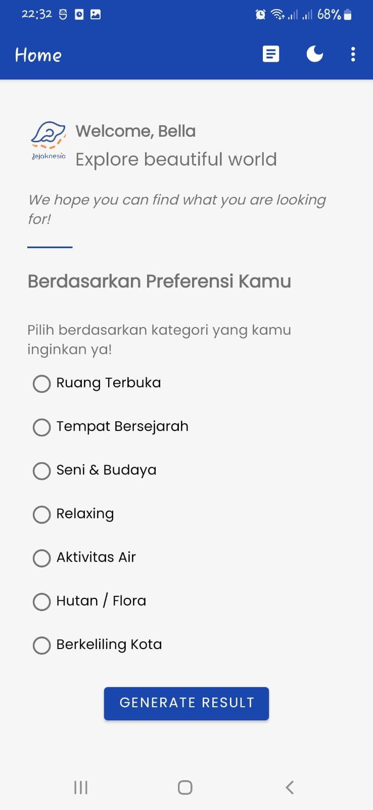

  <h1 align="center">Jejaknesia App</h1>
	

## Theme 🌆
`Tourism`,  `Cultural`,  `Hospitality`

## The flow of project development stages
- Make a User-Interface Design using Figma.
- Create the flow of our application.
- Make our own dataset.
- Make our model in Google Colab & Jupyter Notebook.
- Make our API Documentation in README.md file in github.
- Using Github Organizations.
- Build application using Android Studio.
- Integrate APIs into Android Application. 
- Complete the finalization of the Android Application and verify that it is working well.

## Screenshots

	
	
	
	
	
	
	

	
	
	
	
	

	
## Usage
### How to use the app
1. Open the app
2. Login to your account or Register if you don't have an account
3. Choose what category that fits you
4. Click **Generate Result** button at home screen and wait for the result
5. After the result is appeared, you can tap each of the result to see the detail about the destination
6. You can also see the location of each result by click the **Location** icon on the top right screen
7. You can tap the location, zoom in, zoom out, get to know it more by clicking **Google Map** icon, and also get your location
8. If you want to read some blogs about Tourism, you can click **Article** icon on the HomePage AppBar
9. You can also see the detail of the blog article by tapping each of its.
10. If you want to change the theme mode, you can click **Dark Mode** icon on the HomePage AppBar

## Contributors
| Learning Path       | Student ID     | GitHub Link                                 |
|---------------------|----------------|---------------------------------------------|
| Cloud Computing     | C265DSX1647    | [Aditya Argadinata](https://github.com/Sujaruu)            |
| Cloud Computing     | C265DSX1360    | [Alham Manazil](https://github.com/Alhammanazil)          |
| Machine Learning    | M241DSY1288    | [Baby Aisha Maritza Virginia](https://github.com/LuminetteBourgeons)   |
| Machine Learning    | M295DSX1867    | [Muhammad Naufal Agisya](https://github.com/naufalagisya)          |
| Mobile Development  | A243DSY1059    | [Vanessa Leonora](https://github.com/VanessaLeo24)     |
| Mobile Development  | A243DSX1075    | [Henly Forbesly](https://github.com/henlyforbesly)        |

## Repositories

|   Learning Paths   |                                Link                                |
| :----------------: | :----------------------------------------------------------------: |
| Mobile Development | [Jejaknesia Mobile App](https://github.com/Jejaknesia/mobile_development) |
|  Machine Learning  |  [Jejaknesia Machine Learning Model](https://github.com/Jejaknesia/jejaknesia-machine-models)  |
|   Cloud Computing  |   [Jejaknesia API](https://github.com/Jejaknesia/jejaknesia-api) & [Jejaknesia Model API](https://github.com/Jejaknesia/jejaknesia-models-api)  |

 C23-PS322 Team 

